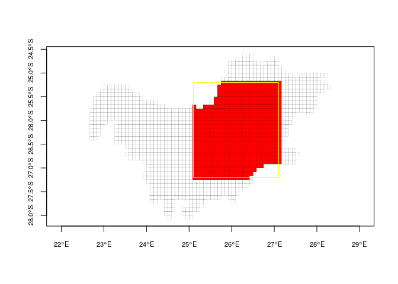

<!-- README.md is generated from README.Rmd. Please edit that file -->

# ABAP

<!-- badges: start -->

[](https://github.com/AfricaBirdData/ABAP/actions/workflows/R-CMD-check.yaml)
<!-- badges: end -->

This packages provides functionality to access, download, and manipulate
data from the [African Bird Atlas Project](http://www.birdmap.africa/).

The objective is to make these data more accessible and easier to
analysis, and eventually make our analyses more reproducible.

There is another package named
[`CWAC`](https://github.com/AfricaBirdData/CWAC) that provides similar
functionality, but now to download count data from the Coordinated
Waterbird Counts project. In addition, there is a companion package the
[`ABDtools`](https://github.com/AfricaBirdData/ABDtools) package, which
adds the functionality necessary to annotate different data formats
(points and polygons) with environmental information from the [Google
Earth Engine data
catalog](https://developers.google.com/earth-engine/datasets).

## INSTRUCTIONS TO INSTALL

To install `ABAP` from GitHub using the
[remotes](https://github.com/r-lib/remotes) package, run:

``` r
install.packages("remotes")
remotes::install_github("AfricaBirdData/ABAP")
```

## DOWNLOAD ABAP DATA FOR A SPECIES

A typical workflow entails defining a region and a species of interest,
e.g. say we are interested in the occupancy of the African Black Duck in
the North West province of South Africa:

First find the ABAP code for the species:

``` r
library(ABAP)
library(sf)
#> Linking to GEOS 3.10.2, GDAL 3.4.1, PROJ 8.2.1; sf_use_s2() is TRUE
library(dplyr, warn.conflicts = FALSE)

# We can search for all duck species
ducks <- searchAbapSpecies("Duck")

# Then we can extract the code we are interested in
ducks[ducks$Common_species == "African Black", "Spp"]
#> # A tibble: 1 × 1
#>   Spp  
#>   <chr>
#> 1 95
```

With our code (95) we can download the data recorded for the region of
interest:

``` r
my_det_data <- getAbapData(.spp_code = 95, .region_type = "province", .region = "North West")
```

Great, but we may be interested in detection data in a set of pentads
that do not correspond to any particular region. What do we do then?
Well, although `getAbapData()` allows you to download data from any one
pentad, it is not advised to use this functionality to loop over a set
of pentads (unless it is a small set). This is because the algorithm
will create a query to the remote database for each pentad, resulting in
a very slow process.

There are two ways of making this process more efficient:

### A spatial subset

One way to obtain data for a set of pentads is to download a larger
region that contains our pentads of interest and then filter only those
we are interested in.

If we know the code for the pentads of interest we could just go ahead
and filter our data. For demonstration purposes let’s subset ten random
pentads in the North West province using the data we just downloaded.
This pentad selection probably doesn’t make much sense, but hopefully it
shows the point.

``` r
set.seed(8476)

pentads_sel <- unique(my_det_data$Pentad) %>% 
  sample(10)

# We can now subset those pentads from the original data
det_data_sel <- my_det_data[my_det_data$Pentad %in% pentads_sel,]
```

However, what we usually have is some sort of polygon defining a region
of interest. If we had an [sf](https://r-spatial.github.io/sf/) polygon,
we could extract the pentads contained in the polygon with

``` r
# We first download all in the North West province pentads (to match our
# original selection above as a spatial object.
nw_pentads <- getRegionPentads(.region_type = "province", .region = "North West")

# Here I am just going to create a polygon randomly, but usually you have a polygon
# that makes sense to you (possibly you would load it with something like
# my_pol <- sf::read_sf("path/to/my/polygon.shp") or something similar)
my_pol <- data.frame(lon = c(25.1, 27.1),
                     lat = c(-27.2, -25.2)) %>%
    st_as_sf(coords = c("lon", "lat"),
             crs = 4326) %>%  # this is WGS84
    st_bbox() %>%
    st_as_sfc()

# Extract pentads within your polygon
my_pentads <- nw_pentads[my_pol,]  # Convenient way of sub-setting spatial objects!

# Subset ABAP data that falls within your polygon
det_data_sel <- my_det_data %>%
    filter(Pentad %in% my_pentads[,"pentad"])

# Plots
plot(st_geometry(nw_pentads), axes = TRUE, lwd = 0.1, cex.axis = 0.7)
plot(st_geometry(my_pentads), add = TRUE, col = "red", lwd = 0.1)
plot(st_geometry(my_pol), add = TRUE, border = "yellow")
```



### Use a pentad group

If we specify “group” in the `.region` argument `getAbapData()` returns
all records for a specific group of pentads. Now, groups of pentads must
be first created from the birdmap.africa websites (e.g., or ). For this,
you will need to create an account. Once logged in, you can create
groups from the coverage menu. Then, these groups can be viewed from you
home menu. The name of the group is the last part of the URL displayed
in the browser’s navigation bar. For example, I created a group named
“test_group”, and the URL for this group is
`⁠https://kenya.birdmap.africa/coverage/group/xxxx_tst_grp`⁠. The group
name th at we need to pass on to the `getAbapData()` function is
`xxxx_tst_grp`, the last part of the URL, where xxxx is your citizen
scientist number (provided when creating an account).

``` r
# Assuming we have created a group named "test_group" with URL ending in
# "xxxx_tst_grp" our getAbapData() call is
my_data <- getAbapData(.spp_code = 95, .region_type = "group", .region = "xxxx_tst_grp")
```

## DOWNLOAD ABAP DATA FOR MULTIPLE SPECIES

At the moment, the process of downloading multi-species data with the
`ABAP` package consists of combining visit data with card record data.
This means we first need to:

1.  Decide on a spatial and temporal selection of data,
2.  Download detection data for any species (just as we saw above),
3.  Extract all cards that correspond to the spatial and temporal
    selection we made
4.  Loop through all card numbers, download the data associated with
    them, and combine

For example, if we wanted to download all data for all species in the
Limpopo region of South Africa for the years 2018 to 2020.

``` r
# Download detection data for any species. These data contain the code for all
# the cards submitted to the project, regardless of the species we download.
sp_data <- getAbapData(.spp = 151, 
                       .region_type = "province",
                       .region = "Limpopo",
                       .years = 2018:2020,
                       .adhoc = FALSE)


# From these data we can extract the cards we are interested in.
my_cards <- unique(sp_data$CardNo)

# Now, this is the painful part, we need to download the data from all the cards
# using a loop

# Create an empty data frame
card_data <- data.frame()

# Loop through cards and download data
for(i in seq_along(my_cards)){
    
    dd <- getCardRecords(.CardNo = my_cards[i])
    card_data <- bind_rows(card_data, dd)
    
}

# To finish up and get a complete data set, we could join the species data with
# the card data (note that we remove species info from pentad data, because it is
# related to the first species we selected "randomly")
final_data <- full_join(pentad_data %>% 
                            select(-c("Spp", "Sequence", "Common_name", "Taxonomic_name")),
                        card_data,
                        by = "CardNo")
```

In the future we would like to make this process easier by allowing
multi-card queries to the database, which would make the process much
more efficient. But for now this is usable workaround.

## INSTRUCTIONS TO CONTRIBUTE CODE

First clone the repository to your local machine:

- In RStudio, create a new project
- In the ‘Create project’ menu, select ‘Version Control’/‘Git’
- Copy the repository URL (click on the ‘Code’ green button and copy the
  link)
- Choose the appropriate directory and ‘Create project’
- Remember to pull the latest version regularly

For site owners:

There is the danger of multiple people working simultaneously on the
project code. If you make changes locally on your computer and, before
you push your changes, others push theirs, there might be conflicts.
This is because the HEAD pointer in the main branch has moved since you
started working.

To deal with these lurking issues, I would suggest opening and working
on a topic branch. This is a just a regular branch that has a short
lifespan. In steps:

- Open a branch at your local machine
- Push to the remote repo
- Make your changes in your local machine
- Commit and push to remote
- Create pull request:
  - In the GitHub repo you will now see an option that notifies of
    changes in a branch: click compare and pull request.
- Delete the branch. When you are finished, you will have to delete the
  new branch in the remote repo (GitHub) and also in your local machine.
  In your local machine you have to use Git directly, because apparently
  RStudio doesn´t do it:
  - In your local machine, change to master branch.
  - Either use the Git GUI (go to branches/delete/select branch/push).
  - Or use the console typing ‘git branch -d your_branch_name’.
  - It might also be necessary to prune remote branches with ‘git remote
    prune origin’.

Opening branches is quick and easy, so there is no harm in opening
multiple branches a day. However, it is important to merge and delete
them often to keep things tidy. Git provides functionality to deal with
conflicting branches. More about branches here:

<https://git-scm.com/book/en/v2/Git-Branching-Branches-in-a-Nutshell>

Another idea is to use the ‘issues’ tab that you find in the project
header. There, we can identify issues with the package, assign tasks and
warn other contributors that we will be working on the code.
